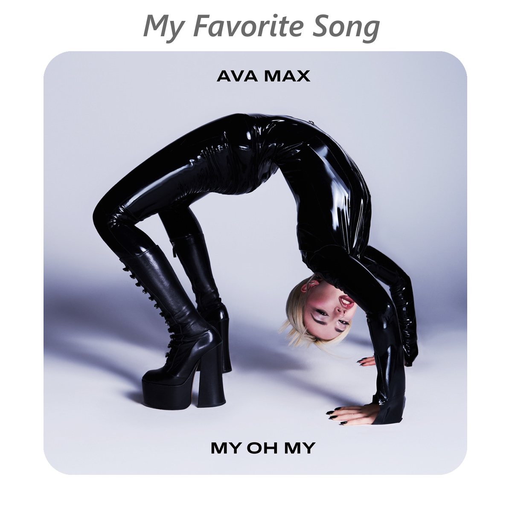

</h1>

    </a>
    
    
    
    </a>
       
</a>   
 
        
## About Me
- 20 Years Old
- My Favorite Game is Fortnite Festival
- My Favorite Music Artists are Ava Max, NF and Tate McRae
- I code stuff for Fortnite Festival mainly
- I know JavaScript, HTML, C++, Python and CSS
##
</a>   
 

&nbsp;

 
    <a href="https://open.spotify.com/track/377uEWjxVKksQDlwDqaIfx?si=a90bbe4a607146f8">
      
  

</a>   
 
